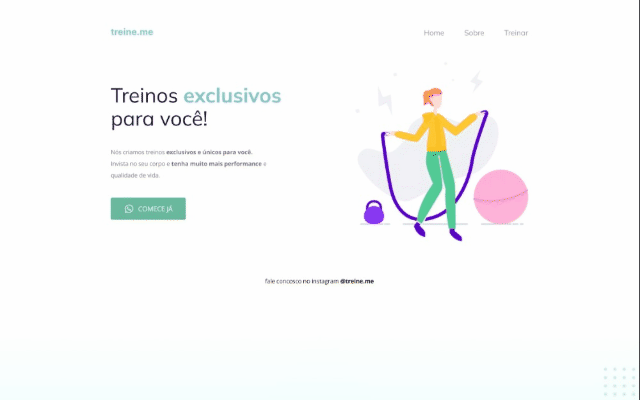

<h1 align="center">
    
</h1>

<p align="center">
  <a href="#-tecnologias">Tecnologias</a>&nbsp;&nbsp;&nbsp;|&nbsp;&nbsp;&nbsp;
  <a href="#-projeto">Projeto</a>&nbsp;&nbsp;&nbsp;|&nbsp;&nbsp;&nbsp;
  <a href="#-layout">Layout</a>
</p>

<p align="center">
 
</p>

<br>

<p align="center">
  
</p>

## 🚀 Tecnologias

Esse projeto foi desenvolvido com as seguintes tecnologias:

- [HTML](https://developer.mozilla.org/pt-BR/docs/Web/HTML)
- [CSS](https://developer.mozilla.org/pt-BR/docs/Web/CSS)

## 💻 Projeto

O projeto foi desenvolvido para colocar em prática os conhecimentos adquiridos em HTML e CSS.
<br>
Treine.me é uma plataforma fictícia de treinos físicos exclusivos que ajuda pessoas a aumentarem sua performance e qualidade de vida.

## 🔖 Layout

Você pode visualizar o layout do projeto através [desse link](https://www.figma.com/file/vKGwWEYo3o90FlVmdi4CQF/Projeto-02-Explorer-Treine.me). Lembrando que você precisa ter uma conta no [Figma](http://figma.com/) para acessá-lo.

---

## ⌨ Como executar o projeto

```bash
# Clonar o repositório
git clone https://github.com/MrPMontes/treine.me

# Entrar no diretório
cd treine.me
```

Feito isso, execute no seu navegador o arquivo `index.html`

---


Feito com ♥ by Pedro Augusto Montes :wave:
